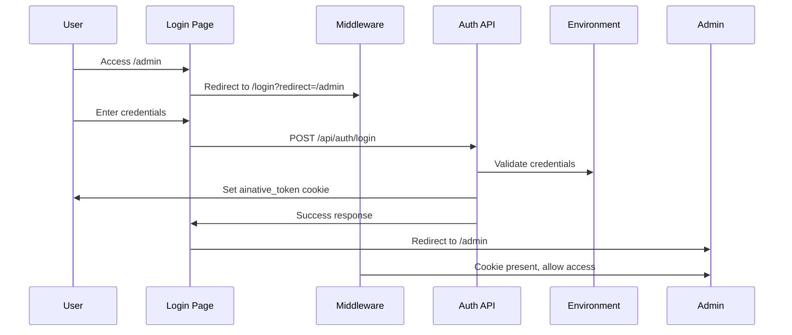
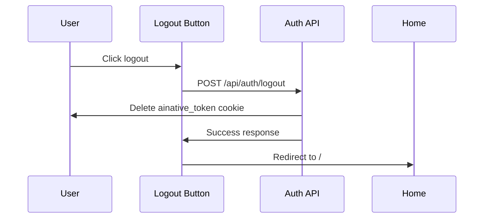

# AINative Authentication Setup

## Overview

This document describes the AINative authentication middleware implementation for the Northbound Studio application. The authentication system uses cookie-based session management to protect administrative routes and API endpoints.

## Architecture

### Components

1. **Middleware** (`/middleware.ts`)
   - Intercepts requests to protected routes
   - Checks for authentication cookie
   - Redirects unauthenticated users to login page
   - Returns 401 for unauthenticated API requests

2. **Login Page** (`/app/login/page.tsx`)
   - User interface for authentication
   - Collects credentials
   - Calls authentication API
   - Redirects to original destination after login

3. **Authentication API Routes** (`/app/api/auth/`)
   - `POST /api/auth/login` - Authenticate and set cookie
   - `POST /api/auth/logout` - Clear authentication cookie
   - `GET /api/auth/session` - Check authentication status

4. **Auth Utilities** (`/lib/auth.ts`)
   - Helper functions for protected routes
   - Token retrieval and validation
   - Credential verification

## Protected Routes

The following routes require authentication:

- `/admin/*` - Admin dashboard and management pages
- `/api/admin/*` - Admin API endpoints

## Authentication Flow

### Login Flow



### Logout Flow



## Environment Variables

The authentication system requires the following environment variables:

```bash
# Primary credentials (recommended)
ZERODB_USERNAME="admin@ainative.studio"
ZERODB_PASSWORD="Admin2025!Secure"
ZERODB_API_TOKEN="kLPiP0bzgKJ0CnNYVt1wq3qxbs2QgDeF2XwyUnxBEOM"

# Legacy aliases (for backward compatibility)
AINATIVE_USERNAME="admin@ainative.studio"
AINATIVE_PASSWORD="Admin2025!Secure"
AINATIVE_API_TOKEN="kLPiP0bzgKJ0CnNYVt1wq3qxbs2QgDeF2XwyUnxBEOM"
```

**Security Note:** These credentials should be stored securely and never committed to version control. Use different credentials for production environments.

## Security Features

### 1. Cookie Security

The authentication cookie (`ainative_token`) is configured with the following security settings:

```typescript
{
  httpOnly: true,        // Prevents JavaScript access (XSS protection)
  secure: true,          // HTTPS only in production
  sameSite: 'lax',       // CSRF protection
  maxAge: 604800,        // 7 days expiration
  path: '/',             // Available throughout the application
}
```

### 2. Server-Side Credential Validation

- Credentials are never exposed to the client
- Validation occurs on the server using environment variables
- Failed login attempts do not reveal which credential was incorrect

### 3. Token-Based Access

- After authentication, an API token is stored in the cookie
- The token is required for all protected API requests
- Tokens can be rotated by updating environment variables

### 4. Request Protection

- Middleware runs before route handlers
- Unauthorized requests are blocked early
- API routes return structured error responses
- Page routes redirect to login with return URL

## Usage Examples

### Protecting a New API Route

```typescript
import { NextRequest, NextResponse } from 'next/server';
import { requireAuth, getAuthToken } from '@/lib/auth';

export async function GET(request: NextRequest) {
  // Check authentication
  const authError = requireAuth();
  if (authError) return authError;

  // Get the auth token if needed
  const token = getAuthToken();

  // Your protected logic here
  return NextResponse.json({ data: 'Protected data' });
}
```

### Protecting a New Page Route

Simply place the page under `/admin/*` and it will be automatically protected by the middleware. For example:

```
/app/admin/dashboard/page.tsx  ✅ Protected
/app/admin/users/page.tsx      ✅ Protected
/app/public/page.tsx           ❌ Not protected
```

### Client-Side Authentication Check

```typescript
'use client';

import { useEffect, useState } from 'react';

export default function ProtectedComponent() {
  const [authenticated, setAuthenticated] = useState(false);

  useEffect(() => {
    fetch('/api/auth/session')
      .then(res => res.json())
      .then(data => setAuthenticated(data.authenticated));
  }, []);

  if (!authenticated) {
    return <div>Please log in to access this content.</div>;
  }

  return <div>Protected content here</div>;
}
```

### Implementing Logout

```typescript
'use client';

import { useRouter } from 'next/navigation';

export function LogoutButton() {
  const router = useRouter();

  const handleLogout = async () => {
    await fetch('/api/auth/logout', { method: 'POST' });
    router.push('/');
  };

  return <button onClick={handleLogout}>Logout</button>;
}
```

## Testing the Authentication System

### Manual Testing

1. **Test Protected Route Access**
   ```bash
   # Should redirect to /login
   curl -i http://localhost:3456/admin
   ```

2. **Test Login**
   ```bash
   curl -X POST http://localhost:3456/api/auth/login \
     -H "Content-Type: application/json" \
     -d '{"username":"admin@ainative.studio","password":"Admin2025!Secure"}' \
     -c cookies.txt
   ```

3. **Test Authenticated Access**
   ```bash
   # Should return 200 OK
   curl -i http://localhost:3456/api/admin/test -b cookies.txt
   ```

4. **Test Session Check**
   ```bash
   curl http://localhost:3456/api/auth/session -b cookies.txt
   # Should return: {"authenticated":true}
   ```

5. **Test Logout**
   ```bash
   curl -X POST http://localhost:3456/api/auth/logout -b cookies.txt -c cookies.txt
   ```

### Browser Testing

1. Visit `http://localhost:3456/admin`
2. Verify redirect to `/login?redirect=/admin`
3. Enter credentials:
   - Username: `admin@ainative.studio`
   - Password: `Admin2025!Secure`
4. Verify successful login and redirect to `/admin`
5. Visit `http://localhost:3456/api/admin/test` to verify API access
6. Logout and verify redirect

## Files Created

```
/middleware.ts                          # Authentication middleware
/app/login/page.tsx                     # Login page UI
/app/api/auth/login/route.ts           # Login endpoint
/app/api/auth/logout/route.ts          # Logout endpoint
/app/api/auth/session/route.ts         # Session verification endpoint
/app/api/admin/test/route.ts           # Example protected API route
/lib/auth.ts                           # Authentication utilities
/docs/AUTHENTICATION.md                 # This documentation
```

## Next Steps

1. **Create Admin Dashboard** - Build the admin interface at `/app/admin/page.tsx`
2. **Add Protected API Routes** - Implement CRUD endpoints for case studies, contacts, etc.
3. **Implement Role-Based Access Control (RBAC)** - Add different permission levels if needed
4. **Add Session Refresh** - Implement token refresh mechanism for long-lived sessions
5. **Add Audit Logging** - Track authentication events and admin actions
6. **Implement Two-Factor Authentication** - Add additional security layer for production

## Troubleshooting

### Login fails with "Invalid username or password"

- Verify environment variables are set correctly in `.env`
- Check that credentials match exactly (case-sensitive)
- Ensure `.env` file is in the project root

### Middleware not running

- Verify `middleware.ts` is in the project root (not `/app` directory)
- Check Next.js version (middleware requires Next.js 12.2+)
- Restart the development server

### Cookie not being set

- Check browser console for errors
- Verify `secure` flag is `false` in development (localhost)
- Check browser privacy settings allow cookies
- Verify API response sets `Set-Cookie` header

### Protected routes accessible without auth

- Check middleware matcher configuration
- Verify route path matches protected patterns
- Clear browser cookies and test again
- Check middleware logs in server console

## Security Best Practices

1. **Never commit credentials** - Use `.env.local` for local development
2. **Use strong passwords** - Minimum 12 characters with mixed case, numbers, symbols
3. **Rotate tokens regularly** - Update API tokens periodically
4. **Enable HTTPS in production** - Required for secure cookies
5. **Implement rate limiting** - Prevent brute force attacks on login endpoint
6. **Monitor authentication logs** - Track failed login attempts
7. **Use environment-specific credentials** - Different tokens for dev/staging/production

## Additional Resources

- [Next.js Middleware Documentation](https://nextjs.org/docs/advanced-features/middleware)
- [HTTP Cookie Security](https://developer.mozilla.org/en-US/docs/Web/HTTP/Cookies)
- [OWASP Authentication Cheat Sheet](https://cheatsheetseries.owasp.org/cheatsheets/Authentication_Cheat_Sheet.html)
